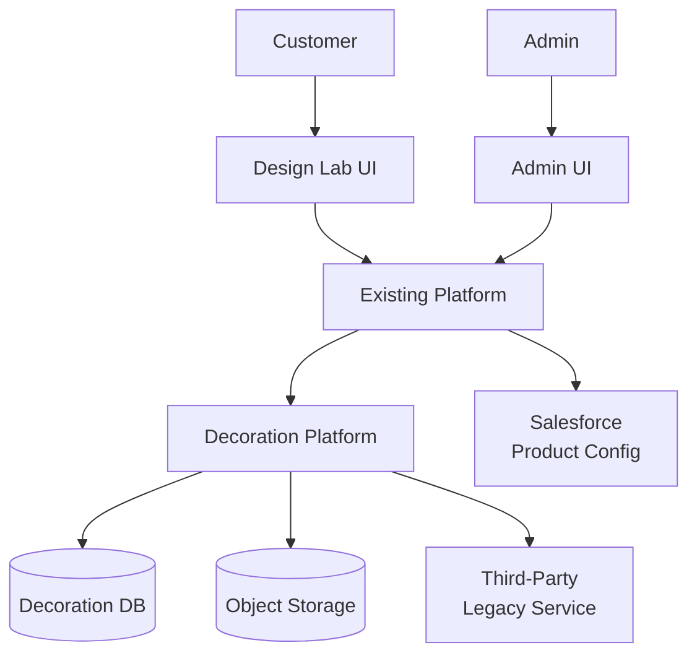

# Overview

## Context diagram

## System goal

Deliver an owned “Decoration Platform” that provides **editor capabilities**, **data persistence**, **preview rendering**, and **production export generation** for garment decorations, reducing dependence on the current third-party service for **new designs**, while maintaining continuity for **legacy designs**. 

## Scope summary

In scope: first-party editor (text + graphic), persistence, preview rendering, production exports, and a legacy continuity strategy. 
In scope (Addendum A): controlled rollout/cutover/rollback controls, explicit legacy edit policy, outage-resilient legacy orderability policy, prototyping workstream, and non-MVP agentic roadmap appendix. 

Out of scope: ownership changes to the garment colouring pipeline, replacing Salesforce as the product configuration source of truth, and modifying the third-party service. 

## Primary workflows

1. **Edit new design**: load style version + spaces → edit decoration elements → save decoration revision. 
2. **Preview**: generate per-side overlays composited on garment views. 
3. **Order/export**: generate production export per space/side for manufacturing. 
4. **Legacy continuity**: ensure legacy designs remain orderable and exportable during retention window. 
5. **Rollout routing**: evaluate deterministic flags (`env → tenant → style → user`) to route owned vs legacy paths and preserve rollback safety. 

## Architectural stance

* Clean Architecture separation is used to keep the domain model and validation rules independent from rendering/export adapters and AWS integration details.
* Preview/export workloads are treated as **scale-out compute** (NFR-0001) with asynchronous execution and caching where appropriate. 

