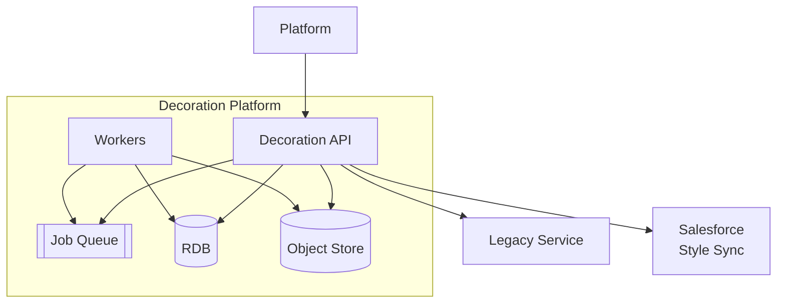
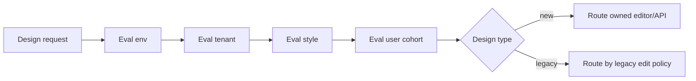
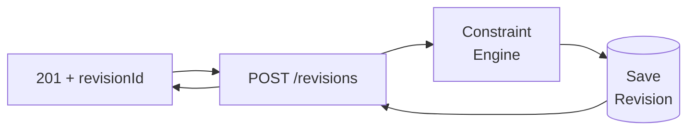
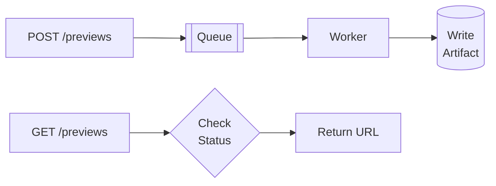
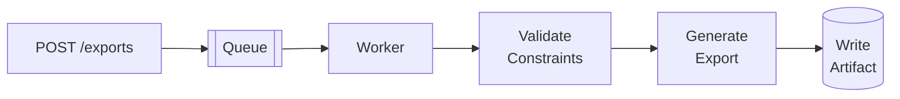
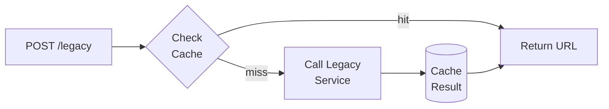
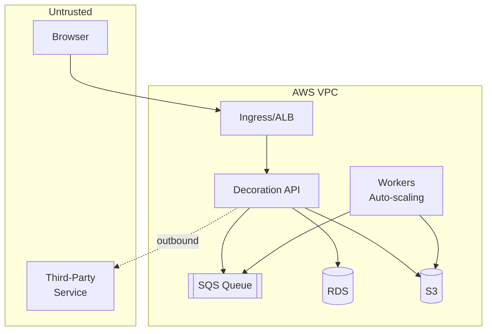

# Architecture

## Mode

MODE B (greenfield for the Decoration Platform components). Rationale: no current architecture/code was provided in the inputs; integration points are treated as external contracts. 

## Bounded contexts and module map

Bounded contexts within owned scope:

1. **Decoration** (core): spaces, elements, constraints, design revisions.
2. **Rendering/Export** (compute): preview and export pipelines.
3. **Assets**: artwork library and availability rules.

Allowed dependencies:
* `Decoration` → `Assets` via IDs/references only.
* `Rendering/Export` → consumes Decoration read models and Assets blobs; writes artifact metadata only.

Forbidden:
* No cross-module persistence model access.

## Containers

* **Design Lab UI (Editor)** — first-party editor for text/graphics. 
* **Decoration API** — persistence/validation/orchestration API. 
* **Render/Export Workers** — scale-out preview/export generators. 
* **Routing Policy Engine** — deterministic policy evaluation for rollout/cutover/rollback (`env → tenant → style → user`) and new-vs-legacy routing. 
* **Style Read Adapter** — consumes style versions + spaces from platform sync. 
* **Legacy Adapter** — integrates with third-party for legacy export continuity. 

## Core flows

### Rollout policy evaluation and deterministic routing
All editor/export entry points evaluate policy in strict order: `environment → tenant → style → user`.
Routing output includes target provider (`owned|legacy`), legacy edit policy, and rollback-safe behavior guarantees. 

### Save decoration revision
UI/Platform calls `POST /designs/{designId}/decoration/revisions` → validate constraints → persist immutable revision. 

### Preview generation
`POST /previews` enqueues job; workers render overlay; API serves artifact URL. 

### Export generation
`POST /exports` enqueues job; workers generate production export; API serves artifact URL. 

### Legacy continuity
`POST /legacy/exports` triggers third-party export via adapter and caches artifact. 

### Legacy orderability during third-party outage
Architecture includes a measurable coverage strategy for legacy export readiness (pre-generation and/or migration), so first-time orderability does not depend on real-time third-party availability. 

## Legacy edit policy

Legacy editing policy is a design-exit decision (OQ-A-0002) but must be deterministic in both UI and APIs:
* `legacy-only` path, or
* `clone-to-new` into owned revision lineage, or
* direct editable import into owned model.

Persisted design metadata carries provider ownership (`decoration_provider=legacy|owned`) to prevent routing ambiguity and support rollback-safe access. 

## Prototyping workstream

Before full build, run a time-boxed prototype that proves one complete path (`place elements → persist → preview → export`) for one process type, with signoff criteria and risk capture. 

## Agentic assistance appendix (non-MVP)

Agentic features are explicitly Phase 2+ and non-blocking for MVP. The architecture records extension points for UX entry, required signals, and safety constraints without implementation commitment in current scope. 

## Patterns (PAT) register

* PAT-0001 Ports and Adapters (DIP) — isolate platform/third-party/storage integrations.
* PAT-0002 Immutable Design Revision Snapshot — stable reload and export inputs.
* PAT-0003 Constraint Engine as pure domain service — no drift between edit/export.
* PAT-0004 Idempotent Job Submission + Artifact Cache — dedupe work and enable scale-out.
* PAT-0005 Legacy artifact read-through cache — reduce ongoing third-party dependency.

(Details captured in ADRs and component contracts.)

## ADR index

* ADR-0001 Deploy as Decoration API + scale-out workers.
* ADR-0002 Relational metadata store + object storage for blobs.
* ADR-0003 Asynchronous preview/export with idempotent job keys.
* ADR-0004 Deterministic export identity uses revision + profile.
* ADR-0005 Legacy continuity via dual-run + read-through export cache.
* ADR-0006 Pin style version at save; add compatibility mapping for reload.
* ADR-0007 Legacy orderability policy (proposed): scheduled pre-generation + cache/read-through.
* ADR-0008 Legacy edit policy (proposed): clone-to-new for editing.

## Deployment with trust boundaries

## Error and failure strategy

* Typed validation failures mapped to RFC7807 ProblemDetails with stable `error_code`.
* Retries only for transient dependency failures; validation failures are terminal. 
