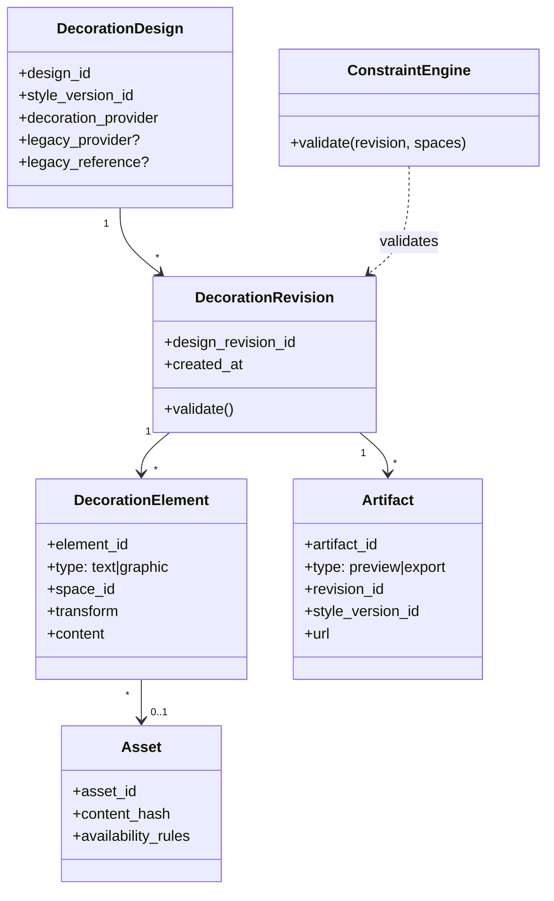

# Domain Model

## Key aggregates

### DecorationDesign
* Identity: `design_id` (platform identifier; ASM-0009 TODO). 
* Attributes: `style_version_id`, `decoration_provider` (`owned|legacy`), optional legacy provider/reference. 

### DecorationRevision (immutable)
* Identity: `design_revision_id`
* Contains per-space `DecorationElement` collections.
* Must satisfy constraint engine at save time. 

### DecorationElement
* Type: `text` or `graphic` (REQ-0002). 
* Stores transform (position/scale; rotation optional OQ-0003). 

### Asset
* Approved artwork selectable in editor (REQ-0009). 

### Artifact
* Preview overlays and production exports; stamped with revision + style version for traceability (REQ-0010). 

## Domain service: ConstraintEngine
Single authoritative validation used by both editor-time save and export-time generation to prevent drift (REQ-0003). 

## Domain model diagram

