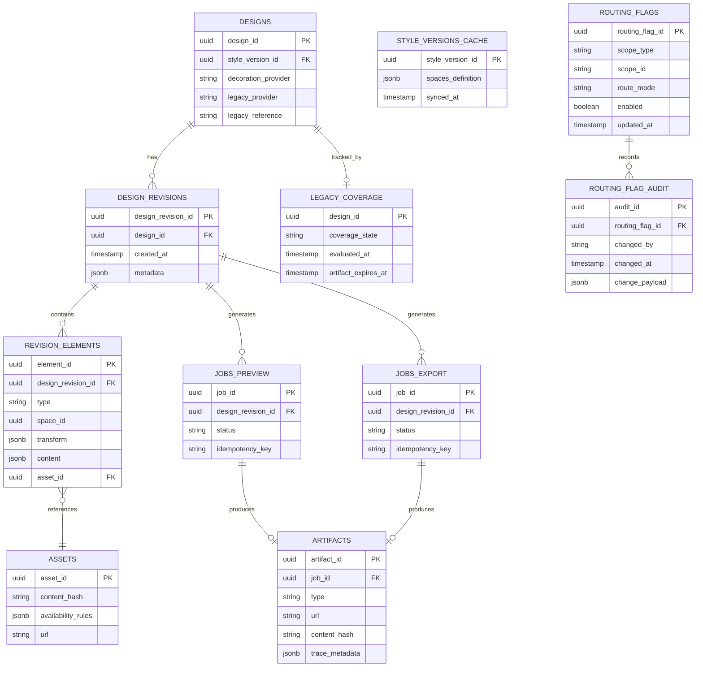

# Data Model

Relational metadata + object storage blobs (ADR-0002). Retention is configurable (ASM-0008 TODO). 

## Tables (logical)

* `designs` — design ownership + provider metadata (`decoration_provider=owned|legacy`) + legacy flags.
* `style_versions_cache` — cached style/space definitions (REQ-0001).
* `design_revisions` — immutable snapshots (REQ-0004/REQ-0010).
* `revision_elements` — per-space elements.
* `assets` — artwork library metadata (REQ-0009).
* `jobs_preview`, `jobs_export` — async job tracking (REQ-0006/REQ-0007).
* `artifacts` — stored previews/exports and trace metadata (REQ-0010).
* `routing_flags` — rollout/cutover/rollback flag values by scope (`env|tenant|style|user`) and evaluation priority. 
* `routing_flag_audit` — auditable change history (`who/when/what`) for rollout and rollback controls. 
* `legacy_coverage` — coverage strategy status for legacy orderability (`cached_export|migrated|alternate_policy`). 

## Object storage keys (logical)

* `assets/{asset_id}/{content_hash}`
* `previews/{design_revision_id}/{side_id}/{preview_profile_id}/{content_hash}.png`
* `exports/{design_revision_id}/{export_profile_id}/{content_hash}.pdf`
* `legacy/{provider}/{legacy_reference}/{content_hash}.pdf`

## Entity-relationship diagram

