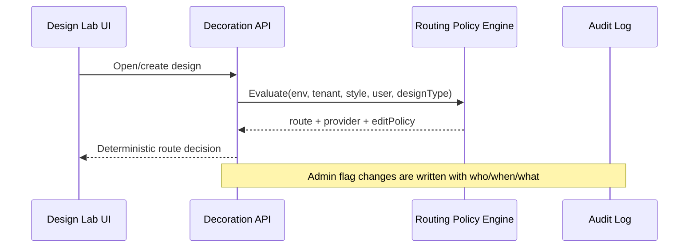
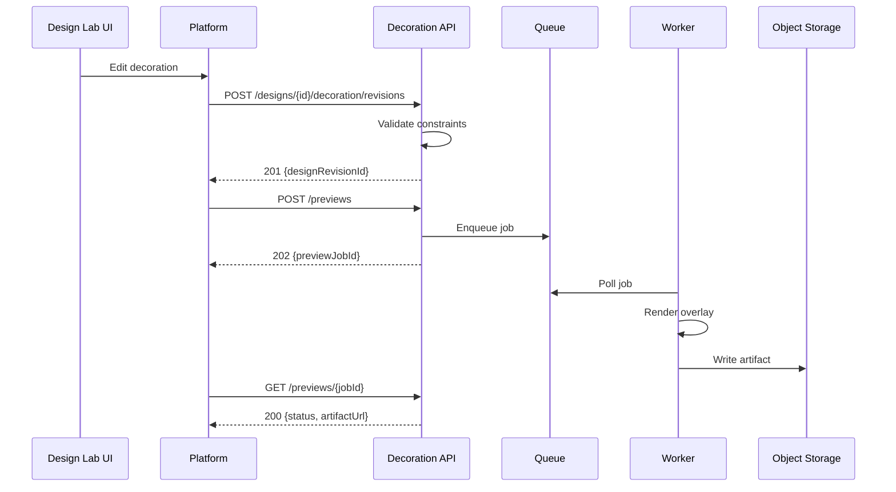
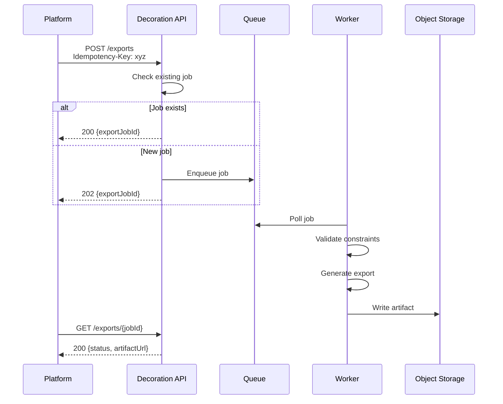
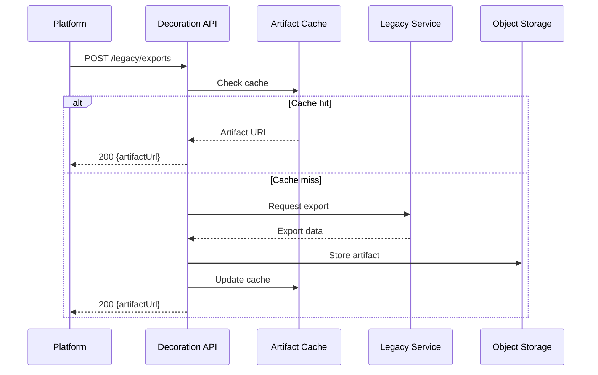
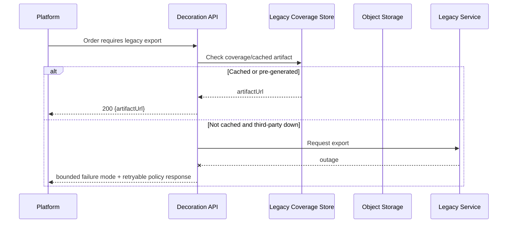

# API Contracts

All endpoints are internal to the platform; external/public exposure is out of scope. Authentication specifics depend on ASM-0002 (TODO). 

## Endpoints

### Styles/spaces (REQ-0001)
* `GET /styles/{styleVersionId}/spaces`

### Decoration persistence (REQ-0004/REQ-0005/REQ-0010)
* `GET /designs/{designId}/decoration`
* `POST /designs/{designId}/decoration/revisions` (supports `Idempotency-Key`)
* `POST /designs/{designId}/clone` (legacy-to-owned clone for editing; gated by routing policy)

### Preview jobs (REQ-0006)
* `POST /previews`
* `GET /previews/{previewJobId}`

### Export jobs (REQ-0007)
* `POST /exports`
* `GET /exports/{exportJobId}`

### Assets (REQ-0009)
* `GET /assets`
* `POST /admin/assets` / `PATCH /admin/assets/{assetId}` / `DELETE /admin/assets/{assetId}` (admin)

### Legacy exports (REQ-0008)
* `POST /legacy/exports`

### Rollout and routing controls (REQ-A-0001/REQ-A-0003)
* `GET /routing/policy/evaluate?designId=...&tenantId=...&styleVersionId=...&userId=...` (debug/admin)
* `PATCH /admin/routing/flags/{scope}` (audited flag changes; scope `env|tenant|style|user`)

### Legacy orderability coverage (REQ-A-0002)
* `POST /admin/legacy/coverage/backfill` (admin trigger for scheduled pre-generation workflow)
* `GET /legacy/coverage` (returns `% covered`, cohort filters, retention window)
* Scheduled interface: `legacy-coverage-backfill` worker schedule (documented internal job contract)

## Critical E2E flows

### Routing evaluation flow (rollout + rollback)

### Save and preview flow

### Export flow with idempotency

### Legacy export with cache

### Legacy first-time order during third-party outage

## Error codes (stable)
* `DECORATION_CONSTRAINT_VIOLATION` (400) — REQ-0003
* `STYLE_SPACE_NOT_FOUND` (404) — REQ-0001/REQ-0004
* `ASSET_NOT_FOUND` (404) — REQ-0009
* `FORBIDDEN` (403) — NFR-0004
* `ROUTING_POLICY_UNRESOLVED` (409) — REQ-A-0001/REQ-A-0003
* `LEGACY_ORDERABILITY_POLICY_UNMET` (503) — REQ-A-0002

ProblemDetails includes `error_code` + `correlation_id`.

Routing-relevant responses include `decoration_provider` (`legacy|owned`) and applicable `edit_policy` for deterministic UI behavior. 

Deterministic routing precedence is always `environment → tenant → style → user`, including clone/backfill-gated flows. 
