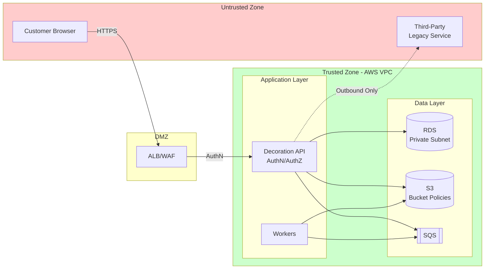

# Security and Trust Boundaries

## AuthN/AuthZ

* TODO: confirm identity provider and claims (ASM-0002). 
* Enforce:
  * Customers can access only their own designs (NFR-0004). 
  * Admin endpoints require Admin/Operations role (REQ-0009). 
  * Rollout/routing flag mutation endpoints require elevated Admin/Operations role and produce immutable audit entries (`who/when/what`). 

## Trust boundaries

* Browser (untrusted) → Platform/UI → Decoration API (trusted).
* Decoration API/Workers → DB/Object/Queue (trusted).
* Legacy adapter → Third-party (untrusted external dependency). 
* Routing policy control plane and audit log store remain in trusted zone; read access is least-privilege and write access is restricted to rollout operators.

## Trust boundary diagram

